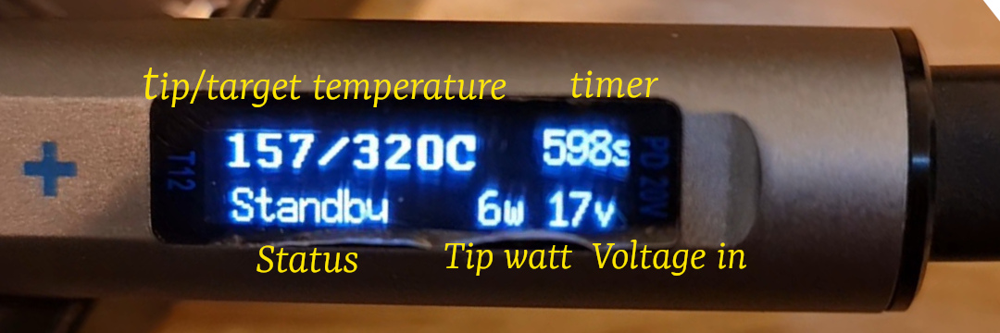

Original firmware: https://github.com/spezifisch/T12PenSolder

# Firmware for cheap T12 Pen Solder - v7 Board

## Changes:
* Updated offset to align the screen display (for v7 board)
* New splash screen
* New display screen
* Auto Standby: 30s from Active
* Auto Off: 5mins after Standby

## Pictures
* Splash screen

* Main display

