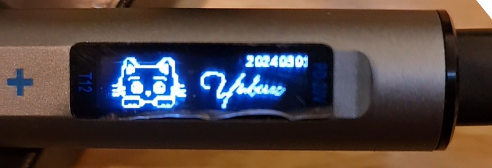
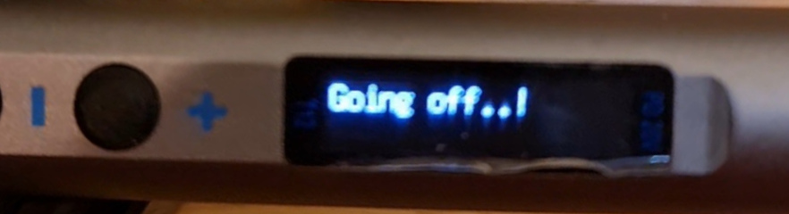

Original firmware: https://github.com/spezifisch/T12PenSolder

# Firmware for cheap T12 Pen Solder - v7 Board

## Changes:
* Updated offset to align the screen display (for v7 board)
* New splash screen
* New display screen
* Auto Standby: 2mins from Active
* Auto Off: 10mins after Standby
* Set button to switch between Active and Standby mode
* Long-press Set button to turn off

## What's next?
* Auto standby when no movement. (Is there motion sensor / accelerometer on this soldering iron?)

## Pictures
* Splash screen

* Main display

* Off display

